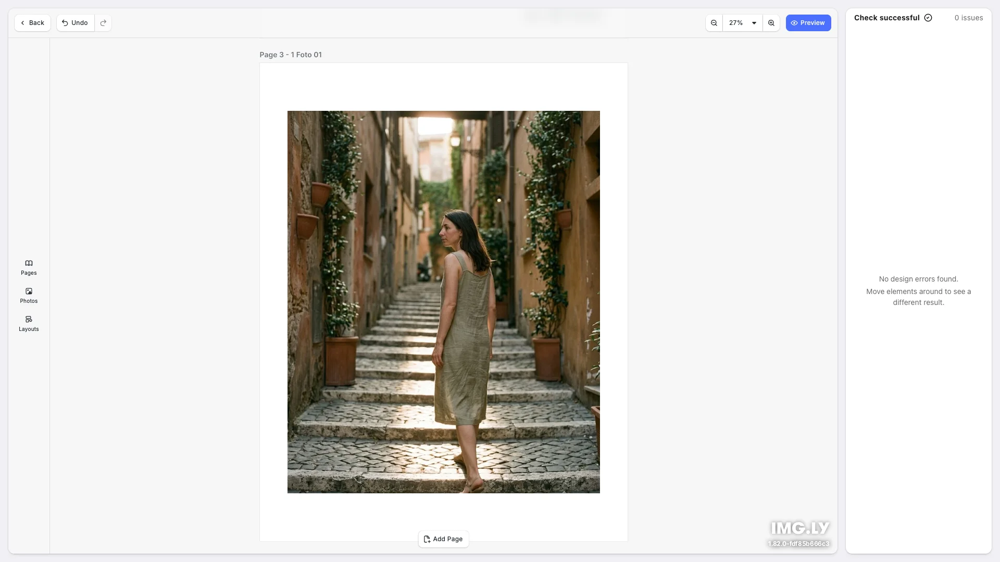

# Photobook Editor Starter Kit

Build photobooks in your web app — pick a size and style, drop in photos, arrange pages with a layouts library, validate the design, and export print-ready PDF/X-4. Built with [CE.SDK](https://img.ly/creative-sdk) by [IMG.LY](https://img.ly). The editor and the PDF export run in the browser; an optional Node export server can take over the rendering.

<p>
  <a href="https://img.ly/docs/cesdk/js/starterkits/photobook-editor-pbedit/">Documentation</a>
</p>



## Getting Started

### Clone the Repository

```bash
git clone https://github.com/imgly/starterkit-photobook-editor-react-web.git
cd starterkit-photobook-editor-react-web
```

### Install Dependencies

```bash
npm install
```

### Download Assets

CE.SDK requires engine assets (fonts, icons, UI elements). Without further setup they load from the IMG.LY CDN, which is for development only. To serve them yourself, download them into `src/client/public/`, the public directory of the web app:

```bash
CESDK_VERSION=$(node -p "require('./node_modules/@cesdk/cesdk-js/package.json').version")
curl -O https://cdn.img.ly/packages/imgly/cesdk-js/$CESDK_VERSION/imgly-assets.zip
unzip imgly-assets.zip -d src/client/public/
rm imgly-assets.zip
```

Then set `baseURL: '/assets'` in the editor configuration in `src/client/src/index.tsx`, and in `CreativeEngine.init` in `src/client/src/app/export-browser.ts`. See [Serve Assets](https://img.ly/docs/cesdk/js/serve-assets-b0827c/) for details.

### Add Your License

Add your license key to the editor configuration in `src/client/src/index.tsx`, and to `CreativeEngine.init` in `src/client/src/app/export-browser.ts`:

```typescript
const config: Configuration = {
  license: 'YOUR_CESDK_LICENSE_KEY',
  userId: 'starterkit-photobook-editor-user'
  // ...
};
```

The export server reads its key from `CESDK_LICENSE` in `.env`, which never reaches the browser:

```bash
cp .env.example .env
```

Get a free trial license at [img.ly/forms/free-trial](https://img.ly/forms/free-trial). Without a license, the editor and the exported PDF show a watermark.

### Run the Development Server

```bash
npm run dev
```

Open `http://localhost:5173` in your browser. Everything, including the PDF export, runs in the browser.

### Run with the Export Server

```bash
npm run dev:server
```

This starts the web app and the export server together (port 8080, proxied at `/api`) and sets `VITE_USE_SERVER=true` for you. Plain `npm run dev` never calls the server, so an export that fails says so instead of silently rendering somewhere else.

## Configuration

### Sizes, Styles, and Distribution

The start screen options live in `src/client/src/app/photobook-options.ts`. Labels are in cm, scene values are in mm.

### Layouts

The layouts plugin lives in `src/client/src/imgly/plugins/layouts/`. When a smaller layout replaces a larger one, the excess photos wait in a per-page stash and flow back when a larger layout returns.

### Design Validation

The detectors live in `src/client/src/imgly/validation.ts`. Check names and descriptions live in `src/client/src/app/validation-config.ts`.

### Example Content

`src/client/src/app/example-photos.ts` holds the photos behind "Use examples".

### Editor Configuration

The `src/client/src/imgly/config/` directory holds the dock, navigation bar, canvas menu, features, and settings. Set your own analytics identifier in `userId` in `src/client/src/index.tsx`.

### Theming

```typescript
cesdk.ui.setTheme('dark'); // 'light' | 'dark' | 'system'
```

See [Theming](https://img.ly/docs/cesdk/js/user-interface/appearance/theming-4b0938/) for custom color schemes and styling.

### Localization

```typescript
cesdk.i18n.setTranslations({
  de: { 'common.save': 'Speichern' }
});
cesdk.i18n.setLocale('de');
```

See [Localization](https://img.ly/docs/cesdk/js/user-interface/localization-508e20/) for supported languages and translation keys.

## Architecture

```
starterkit-photobook-editor-react-web/
├── src/
│   ├── client/                   # Web app (Vite + React)
│   │   ├── index.html
│   │   └── src/
│   │       ├── index.tsx         # Application entry point
│   │       ├── app/              # Application shell
│   │       │   ├── App.tsx           # start | editor | preview state machine
│   │       │   ├── StartScreen/      # Size, style, and photo distribution
│   │       │   ├── UploadModal/      # Photo upload
│   │       │   ├── ValidationSidebar/ # Live validation results
│   │       │   ├── export.ts         # Export client (browser or server)
│   │       │   └── print-ready-pdf.ts # PDF/X-4 conversion
│   │       └── imgly/            # Reusable editor logic
│   │           ├── index.ts          # Editor initialization
│   │           ├── config/           # Actions, features, settings, i18n, UI
│   │           ├── plugins/layouts/  # Layouts library
│   │           ├── autofill.ts       # Photo auto-fill
│   │           ├── preview-mode.ts   # Page-spread preview
│   │           └── validation.ts     # Design validation
│   ├── server/                   # Export server (Express + @cesdk/node-native)
│   │   ├── index.ts              # Server entry point
│   │   ├── imgly/                # Engine lifecycle, export pipeline, timeout
│   │   ├── jobs/                 # Job store, rate windows, expiry
│   │   └── http/                 # Routes, admission middleware, errors
│   └── shared/                   # Wire types shared by the app and the server
├── .env.example
├── package.json
└── vite.config.ts
```

The app is a `start | editor | preview` state machine (`src/client/src/app/App.tsx`). The editor stays mounted across `editor` and `preview`. The preview is a mode of the editor (`src/client/src/imgly/preview-mode.ts`) that switches the scene into page spreads and swaps the editor chrome. It is not a separate screen.

## Export Server

"Export as PDF" renders in the browser, or on the export server when `VITE_USE_SERVER=true`. Either way, the browser converts the PDF to PDF/X-4 (FOGRA39) with `@imgly/plugin-print-ready-pdfs-web`.

With the server, the client uploads the scene archive to `POST /api/export`, polls `GET /api/export/:id`, and downloads the rendered PDF from `GET /api/export/:id/file`. The server renders with the GPU-accelerated `@cesdk/node-native` engine, which keeps a large book off the browser's main thread.

The server enforces these limits (see `src/server/http/routes.ts` and `src/server/jobs/store.ts`):

- A 256 MB request body cap
- Three active jobs in total, one per client
- Ten exports per client per ten minutes
- Five minutes to download a finished PDF

The server shows these hardening patterns but ships without TLS or authentication. Put a real gateway in front of it before you expose it.

The port (8080) appears in `src/server/index.ts` and in the proxy in `vite.config.ts`. The server runs TypeScript through [tsx](https://tsx.is). Keep `@cesdk/node-native` on the same version as the CE.SDK packages of the web app.

See [Export for Printing](https://img.ly/docs/cesdk/js/export-save-publish/for-printing-bca896/) for print export options.

## Key Capabilities

- **Start Screen** – Pick a book size, a style, and how photos spread across pages
- **Layouts Library** – Switch page layouts without losing photos
- **Photo Auto-Fill** – Place each photo in the slot that crops it least, and fill the captions
- **Design Validation** – Live checks for print problems, listed in a sidebar
- **Spread Preview** – Review the book as page spreads inside the editor
- **Print-Ready Export** – PDF/X-4 (FOGRA39), in the browser or on a Node server

## Prerequisites

- **Node.js v22+** with npm – [Download](https://nodejs.org/)
- **Supported browsers** – Chrome 114+, Edge 114+, Firefox 115+, Safari 15.6+
- **Export server platforms** – macOS (ARM or x64), Linux x64 with glibc 2.39 or later, or Windows x64

## Troubleshooting

| Issue                             | Solution                                                                                                                               |
| --------------------------------- | -------------------------------------------------------------------------------------------------------------------------------------- |
| Editor doesn't load               | Verify assets are accessible at `baseURL`, and check your license key                                                                  |
| Assets don't appear               | Check `src/client/public/assets/` directory exists                                                                                     |
| Watermark appears                 | Add your license key to the editor configuration, and `CESDK_LICENSE` to `.env` for the export server                                  |
| Export is slow or freezes the tab | The PDF/X conversion runs in the browser and takes most of a large export. `npm run dev:server` moves only the rendering to the server |
| "The export server is busy"       | The server rate limits answered 429. Retry in a moment                                                                                 |
| Uploads are skipped               | The kit accepts only JPEG, PNG, and WebP files                                                                                         |

## Documentation

For complete integration guides and API reference, visit the [Photobook Editor Documentation](https://img.ly/docs/cesdk/js/starterkits/photobook-editor-pbedit/).

## Demo Assets

The demo assets for this starter kit load from the IMG.LY CDN by default, and
`.env.example` links a zip with them. To host them yourself, upload the
extracted files to your own server or CDN and set `VITE_DEMO_ASSETS_BASE_URL`
in `.env`:

```bash
VITE_DEMO_ASSETS_BASE_URL=https://cdn.yourdomain.com/demo-assets
```

The demo assets are intended for development and prototyping — replace
them with your own content or licensed stock assets before shipping to
production (see `DEMO-ASSETS-NOTICE.txt` in the download). This applies in
particular to media such as music tracks and stock imagery.

## License

This project is licensed under the MIT License - see the [LICENSE](LICENSE) file for details.

---

<p align="center">Built with <a href="https://img.ly/creative-sdk?utm_source=github&utm_medium=project&utm_campaign=starterkit-photobook-editor">CE.SDK</a> by <a href="https://img.ly?utm_source=github&utm_medium=project&utm_campaign=starterkit-photobook-editor">IMG.LY</a></p>
